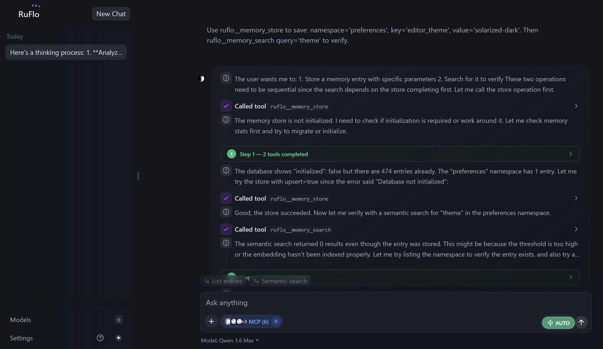
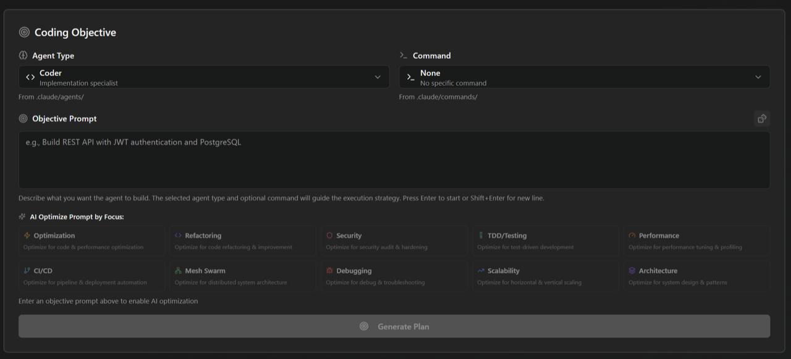

<div align="center">


<!-- 试用 Swarmlo —— 4 个新访客最可能点击的徽章 -->
[](https://flo.ruv.io/)
[](https://www.npmjs.com/package/swarmlo)
[](https://opensource.org/licenses/MIT)
[](https://github.com/z451047442-debug/swarmlo)

<!-- 生态条（以 flat-square 样式视觉折叠） -->
[](https://goal.ruv.io/)
[](https://goal.ruv.io/agents)
[](https://github.com/ruvnet/ruvector)
[](https://github.com/z451047442-debug/swarmlo/blob/main/data/clone-data.proof.json)
[](https://github.com/z451047442-debug/swarmlo/blob/main/data/clone-data.ledger.json)
[](https://github.com/z451047442-debug/swarmlo)
[![Codex Plugin](https://img.shields.io/badge/Codex-Plugin-412991?style=flat-square&logoColor=white&logo=data%3Aimage%2Fsvg%2Bxml%3Bbase64%2CPHN2ZyB4bWxucz0iaHR0cDovL3d3dy53My5vcmcvMjAwMC9zdmciIHZpZXdCb3g9IjAgMCAyNCAyNCI%2BPHBhdGggZmlsbD0id2hpdGUiIGQ9Ik0yMi4yODIgOS44MjFhNS45ODUgNS45ODUgMCAwIDAtLjUxNi00LjkxIDYuMDQ2IDYuMDQ2IDAgMCAwLTYuNTEtMi45QTYuMDY1IDYuMDY1IDAgMCAwIDQuOTgxIDQuMThhNS45ODUgNS45ODUgMCAwIDAtMy45OTggMi45IDYuMDQ2IDYuMDQ2IDAgMCAwIC43NDMgNy4wOTcgNS45OCA1Ljk4IDAgMCAwIC41MSA0LjkxMSA2LjA1MSA2LjA1MSAwIDAgMCA2LjUxNSAyLjlBNS45ODUgNS45ODUgMCAwIDAgMTMuMjYgMjRhNi4wNTYgNi4wNTYgMCAwIDAgNS43NzItNC4yMDYgNS45OSA1Ljk5IDAgMCAwIDMuOTk4LTIuOSA2LjA1NiA2LjA1NiAwIDAgMC0uNzQ3LTcuMDczek0xMy4yNiAyMi40M2E0LjQ3NiA0LjQ3NiAwIDAgMS0yLjg3Ni0xLjA0bC4xNDItLjA4IDQuNzc4LTIuNzU4YS43OTUuNzk1IDAgMCAwIC4zOTMtLjY4MXYtNi43MzdsMi4wMiAxLjE2OGEuMDcxLjA3MSAwIDAgMSAuMDM4LjA1MnY1LjU4M2E0LjUwNCA0LjUwNCAwIDAgMS00LjQ5NSA0LjQ5NHpNMy42IDE4LjMwNGE0LjQ3IDQuNDcgMCAwIDEtLjUzNS0zLjAxNGwuMTQyLjA4NSA0Ljc4MyAyLjc1OWEuNzcxLjc3MSAwIDAgMCAuNzgxIDBsNS44NDMtMy4zNjl2Mi4zMzJhLjA4LjA4IDAgMCAxLS4wMzMuMDYyTDkuNzQgMTkuOTVhNC41IDQuNSAwIDAgMS02LjE0LTEuNjQ2ek0yLjM0IDcuODk2YTQuNDg1IDQuNDg1IDAgMCAxIDIuMzY2LTEuOTczVjExLjZhLjc2Ni43NjYgMCAwIDAgLjM4OC42NzdsNS44MTUgMy4zNTQtMi4wMiAxLjE2OGEuMDc2LjA3NiAwIDAgMS0uMDcyIDBsLTQuODMtMi43ODZBNC41MDQgNC41MDQgMCAwIDEgMi4zNCA3Ljg3MnptMTYuNTk3IDMuODU1LTUuODMzLTMuMzg3IDIuMDE2LTEuMTY1YS4wNzYuMDc2IDAgMCAxIC4wNzEgMGw0LjgzIDIuNzkxYTQuNDk0IDQuNDk0IDAgMCAxLS42NzYgOC4xMDR2LTUuNjc3YS43OS43OSAwIDAgMC0uNDA3LS42Njd6bTIuMDEtMy4wMjMtLjE0MS0uMDg1LTQuNzc0LTIuNzgyYS43NzYuNzc2IDAgMCAwLS43ODUgMEw5LjQwOSA5LjIzVjYuODk3YS4wNjYuMDY2IDAgMCAxIC4wMjgtLjA2Mmw0LjgzLTIuNzg3YTQuNDk5IDQuNDk5IDAgMCAxIDYuNjggNC42NnpNOC4zMDcgMTIuODYzbC0yLjAyLTEuMTY0YS4wOC4wOCAwIDAgMS0uMDM4LS4wNTdWNi4wNzRhNC40OTkgNC40OTkgMCAwIDEgNy4zNzYtMy40NTRsLS4xNDIuMDgtNC43NzggMi43NThhLjc5NS43OTUgMCAwIDAtLjM5My42ODJ6bTEuMDk3LTIuMzY2IDIuNjAyLTEuNSAyLjYwNyAxLjV2Mi45OTlsLTIuNTk3IDEuNS0yLjYwNy0xLjVaIi8%2BPC9zdmc%2B)](https://www.npmjs.com/package/@claude-flow/codex)

# Swarmlo

**面向 Claude Code 和 Codex 的智能体元脚手架（meta-harness）。**

</div>

> **智能体 = 模型 + 脚手架。** 模型负责写代码；脚手架为它提供工具、记忆、循环、沙箱和控制，让它能真正干活。**Swarmlo 就是这个脚手架** —— 围绕 Claude Code 和 Codex 的执行层，新增 100+ 专业智能体、协同蜂群、自学习记忆、跨机器联邦通信，以及企业级安全护栏。智能体不只是运行，而是协作。

一条 `npx swarmlo init` 命令就能给 Claude Code 装上神经系统：智能体自组织成蜂群、从每个任务中学习、跨会话记住上下文，并且——通过联邦——能够安全地与其他机器上的智能体通信而不泄露数据。你继续写代码，协调工作交给 Swarmlo。

```
自学习 / 自优化智能体架构

用户 --> Swarmlo（CLI/MCP） --> 路由器 --> 蜂群 --> 智能体 --> 记忆 --> LLM 供应商
                             ^                          |
                             +---- 学习循环 <-----------+
```

> **刚接触 Swarmlo？** 你不需要先学会 314 个 MCP 工具或 26 条 CLI 命令。完成 `init` 之后，像平时一样使用 Claude Code 即可——hooks 系统会自动路由任务、从成功模式中学习，并在后台协调智能体。

<details>
<summary><strong>📖 背景 —— 名字的由来</strong></summary>

> Claude Flow 现已更名为 Swarmlo —— 命名者是 [`rUv`](https://ruv.io)，他热爱 Rust、心流（flow）状态，以及打造那些水到渠成的东西。「Ru」取自 rUv，「flo」是工作到凌晨 3 点。底层由 [`Cognitum.One`](https://cognitum.one/?Swarmlo) 智能体架构驱动，运行着一个强化的 Rust AI 引擎、嵌入向量、记忆和插件系统。

</details>

---


## 快速开始

有**两条差异很大的安装路径**，覆盖范围完全不同。按需选择（#1744）：

| | **Claude Code 插件** | **CLI 安装（`npx swarmlo init`）** |
|---|---|---|
| 提供什么 | 每个插件提供斜杠命令 + 少量技能 + 智能体定义 | 完整的 Swarmlo 循环 —— 98 个智能体、60+ 命令、30 个技能、MCP 服务器、hooks、守护进程 |
| 工作区中的文件 | **零个** | `.claude/`、`.claude-flow/`、`CLAUDE.md`、helpers、settings |
| 注册 MCP 服务器 | 仅当安装了 `swarmlo-core` 时（它自带 `.mcp.json`）—— 其他大多数插件不会 | 会 |
| 安装 hooks | 不会 | 会 |
| 最适合 | 只想试用某个插件的命令、不想完整安装 | 生产使用 —— 一切按文档正常工作 |

### 路径 A —— Claude Code 插件（轻量，仅斜杠命令）

```bash
# 添加市场
/plugin marketplace add z451047442-debug/swarmlo

# 安装 core 以及你需要的任何插件
/plugin install swarmlo-core@swarmlo
/plugin install swarmlo-swarm@swarmlo
/plugin install swarmlo-rag-memory@swarmlo
/plugin install swarmlo-neural-trader@swarmlo
```

这会添加斜杠命令和智能体定义。上面安装的 `swarmlo-core` 在安装时确实会注册自己的 MCP 服务器 —— 其工具以 `mcp__plugin_swarmlo-core_swarmlo__*` 形式调用（例如 `mcp__plugin_swarmlo-core_swarmlo__memory_store`），而不是 CLI 路线脚手架所使用的裸 `memory_store`/`swarm_init`/`agent_spawn` 名称。其他插件通常不附带自己的 MCP 服务器。如需使用 CLI 路线工具名的完整循环，请改用下方的路径 B。

<details>
<summary><strong>🔌 全部 35 个插件</strong></summary>

#### 核心与编排

| 插件 | 作用 |
|--------|-------------|
| [**swarmlo-core**](plugins/swarmlo-core/README.md) | 基础 —— 服务器、健康检查、插件发现 |
| [**swarmlo-swarm**](plugins/swarmlo-swarm/README.md) | 将多个智能体组队协同 |
| [**swarmlo-autopilot**](plugins/swarmlo-autopilot/README.md) | 让智能体在循环中自主运行 |
| [**swarmlo-loop-workers**](plugins/swarmlo-loop-workers/README.md) | 按定时器调度后台任务 |
| [**swarmlo-workflows**](plugins/swarmlo-workflows/README.md) | 可复用的多步骤任务模板 |
| [**swarmlo-federation**](plugins/swarmlo-federation/README.md) | 不同机器上的智能体安全协作 |

#### 记忆与知识

| 插件 | 作用 |
|--------|-------------|
| [**swarmlo-agentdb**](plugins/swarmlo-agentdb/README.md) | 用于智能体记忆的快速向量数据库 |
| [**swarmlo-rag-memory**](plugins/swarmlo-rag-memory/README.md) | 智能检索 —— 混合搜索、图跳转、多样性排序 |
| [**swarmlo-rvf**](plugins/swarmlo-rvf/README.md) | 跨会话保存与恢复智能体记忆 |
| [**swarmlo-ruvector**](plugins/swarmlo-ruvector/README.md) | [`ruvector`](https://npmjs.com/package/ruvector) —— GPU 加速搜索、Graph RAG、103 个工具 |
| [**swarmlo-knowledge-graph**](plugins/swarmlo-knowledge-graph/README.md) | 构建并遍历实体关系图谱 |

#### 智能与学习

| 插件 | 作用 |
|--------|-------------|
| [**swarmlo-intelligence**](plugins/swarmlo-intelligence/README.md) | 智能体从过往成功中学习、变得更聪明 |
| [**swarmlo-graph-intelligence**](plugins/swarmlo-graph-intelligence/) | 次线性图推理 —— PageRank、增量更新、复杂度感知执行（ADR-123） |
| [**swarmlo-daa**](plugins/swarmlo-daa/README.md) | 动态智能体行为与认知模式 |
| [**swarmlo-ruvllm**](plugins/swarmlo-ruvllm/README.md) | 运行本地 LLM（Ollama 等）并智能路由 |
| [**swarmlo-goals**](plugins/swarmlo-goals/README.md) | 将大目标拆解为计划并跟踪进度 |

#### 代码质量与测试

| 插件 | 作用 |
|--------|-------------|
| [**swarmlo-testgen**](plugins/swarmlo-testgen/README.md) | 找出缺失的测试并自动生成 |
| [**swarmlo-browser**](plugins/swarmlo-browser/README.md) | 用 Playwright 自动化浏览器测试 |
| [**swarmlo-jujutsu**](plugins/swarmlo-jujutsu/README.md) | 分析 git diff、评估风险、推荐评审人 |
| [**swarmlo-docs**](plugins/swarmlo-docs/README.md) | 自动生成与维护文档 |

#### 安全与合规

| 插件 | 作用 |
|--------|-------------|
| [**swarmlo-security-audit**](plugins/swarmlo-security-audit/README.md) | 扫描漏洞与 CVE |
| [**swarmlo-aidefence**](plugins/swarmlo-aidefence/README.md) | 拦截提示词注入、检测 PII、安全扫描 |

#### 架构与方法论

| 插件 | 作用 |
|--------|-------------|
| [**swarmlo-adr**](plugins/swarmlo-adr/README.md) | 用动态记录跟踪架构决策 |
| [**swarmlo-ddd**](plugins/swarmlo-ddd/README.md) | 脚手架领域驱动设计 —— 上下文、聚合、事件 |
| [**swarmlo-sparc**](plugins/swarmlo-sparc/README.md) | 带质量门禁的 5 阶段引导式开发方法论 |
| [**swarmlo-metaharness**](plugins/swarmlo-metaharness/README.md) | 给你的智能体配置打分、扫描工具配置的安全风险、跟踪随时间的变化（[指南](docs/metaharness-user-guide.md)） |
| [**swarmlo-arena**](plugins/swarmlo-arena/README.md) | 竞争性 ruliology —— 在锦标赛中让智能体策略互相较量，爬山并共同进化胜者（ADR-147/148） |

#### DevOps 与可观测性

| 插件 | 作用 |
|--------|-------------|
| [**swarmlo-migrations**](plugins/swarmlo-migrations/README.md) | 安全管理数据库 schema 变更 |
| [**swarmlo-observability**](plugins/swarmlo-observability/README.md) | 结构化日志、追踪与指标集中管理 |
| [**swarmlo-cost-tracker**](plugins/swarmlo-cost-tracker/README.md) | 跟踪 token 用量、设置预算、获取成本告警 |

#### 可扩展性

| 插件 | 作用 |
|--------|-------------|
| [**swarmlo-agent**](plugins/swarmlo-agent/README.md) | 运行智能体 —— 本地 WASM 沙箱（rvagent）+ Anthropic Claude 托管智能体（云端） |
| [**swarmlo-plugin-creator**](plugins/swarmlo-plugin-creator/README.md) | 脚手架、验证并发布你自己的插件 |

#### 领域专属

| 插件 | 作用 |
|--------|-------------|
| [**swarmlo-iot-cognitum**](plugins/swarmlo-iot-cognitum/README.md) | IoT 设备管理 —— 信任评分、异常检测、设备群 |
| [**swarmlo-neural-trader**](plugins/swarmlo-neural-trader/README.md) | [`neural-trader`](https://npmjs.com/package/neural-trader) —— 4 个智能体的 AI 交易、回测、112+ 工具 |
| [**swarmlo-market-data**](plugins/swarmlo-market-data/README.md) | 摄取市场数据、向量化 OHLCV、检测模式 |

</details>

### CLI 安装

**macOS / Linux / WSL / Git-Bash：**

```bash
# 一行安装（仅 POSIX shell —— 见下方 Windows 说明）
curl -fsSL https://cdn.jsdelivr.net/gh/z451047442-debug/swarmlo@main/scripts/install.sh | bash
```

**所有平台（包括原生 Windows PowerShell / cmd）：**

```bash
# 交互式安装向导 —— 在所有平台上运行方式一致
npx swarmlo@latest init wizard

# 快速非交互式初始化
# npx swarmlo@latest init

# 或全局安装
npm install -g swarmlo@latest
```

> 💡 **Windows 用户：** `curl ... | bash` 形式需要 POSIX shell（Git-Bash、WSL、MSYS）。`npx swarmlo@latest init wizard` 这一行在 PowerShell 和 cmd 中原生可用。如果遇到 `'bash' is not recognized` 错误，改用 `npx` 那一行即可 —— 两者最终执行的是同一个初始化流程。

### MCP 服务器

```bash
# 在 Claude Code 中将 Swarmlo 添加为 MCP 服务器
claude mcp add claude-flow -- npx swarmlo@latest mcp start
```

---

## 你能获得什么

| 能力 | 描述 |
|------------|-------------|
| 🤖 **100+ 智能体** | 面向编码、测试、安全、文档、架构的专业智能体 |
| 📡 **通信层** | 零信任联邦 —— 跨机器/组织的智能体相互发现、认证并安全交换工作 |
| 🐝 **蜂群协调** | 层级、网状与自适应拓扑，带共识机制 |
| 🧠 **自学习** | SONA 神经模式、ReasoningBank、轨迹学习 |
| 💾 **向量记忆** | HNSW 索引的 AgentDB —— 实测在 N=20k 时比暴力搜索快约 1.9 倍，N=5k 时约 3.2–4.7 倍（recall@10 约 0.99）；在交叉点之上 ANN 胜出，小规模 N 时打平或落后。见[审计报告](docs/reviews/intelligence-system-audit-2026-05-29.md) + [`scripts/benchmark-intelligence.mjs`](scripts/benchmark-intelligence.mjs) |
| ⚡ **后台工作进程** | 12 个自动触发的工作进程（audit、optimize、testgaps 等） |
| 🧩 **插件市场** | 33 个原生 Claude Code 插件 + 21 个 npm 插件 |
| 🔌 **多模型供应商** | Claude、GPT、Gemini、Cohere、Ollama，带智能路由 |
| 🛡️ **安全** | AIDefence、输入校验、CVE 修复、路径穿越防护 |
| 🌐 **智能体联邦** | 跨安装的智能体协作，零信任安全 |
| 🔬 **[MetaHarness](docs/metaharness-user-guide.md)** | 在发布前审计你的 AI 智能体配置。评估就绪度（1-100）、扫描工具配置的安全问题、快照整个项目以捕捉随时间的回归、查找匹配你仓库的模板。`swarmlo eject` 可将 swarmlo 项目变成拥有自己名字的独立智能体工具包。[完整指南](docs/metaharness-user-guide.md)。 |
| 💬 **[Web UI 测试版](https://flo.ruv.io/)** | flo.ruv.io 上的多模型聊天，支持并行 MCP 工具调用与浏览器内 WASM 工具画廊 |
| 🎯 **[Swarmlo Research](https://goal.ruv.io/)** | goal.ruv.io 上的 GOAP A\* 规划器 —— 用平实的英语描述目标 → 可执行的智能体计划，并在 [/agents](https://goal.ruv.io/agents) 提供实时智能体仪表盘 |

<p align="center">
  <a href="https://flo.ruv.io/">
    
  </a>
</p>

### Web UI（测试版）—— 可自托管，托管演示见 [flo.ruv.io](https://flo.ruv.io/)

**Swarmlo 的 Web UI 是一个内置 Model Context Protocol（MCP）工具调用的多模型 AI 聊天。** 与 Qwen、Claude、Gemini 或 OpenAI 对话时，Swarmlo 会直接从聊天中调用 CLI 所用的同一批 MCP 工具 —— 智能体编排、持久化记忆、蜂群协调、代码评审、GitHub 操作。无需安装，也无需 API key 即可试用。

| | 它是什么 | 为什么重要 |
|---|------------|----------------|
| 🧠 | **任意模型，本地或远程** | 开箱即用的 6 个精选前沿模型 —— Qwen 3.6 Max（默认）、Claude Sonnet 4.6、Claude Haiku 4.5、Gemini 2.5 Pro、Gemini 2.5 Flash、OpenAI —— 经 OpenRouter 接入。也可自行添加：任何 OpenAI 兼容端点（vLLM、Ollama、LM Studio、Together、Groq、自托管）。 |
| 🦾 | **ruvLLM 自学习 AI** | 原生支持 [ruvLLM](https://github.com/ruvnet/RuVector/tree/main/examples/ruvLLM)（位于 `ruvnet/RuVector/examples/ruvLLM`）—— Swarmlo 的自改进本地模型层。路由到 MicroLoRA 适配器、通过 SONA 从你的轨迹中学习，并且数据留在你的机器上。可与云端模型搭配使用，也可完全离线运行。 |
| 🛠️ | **约 210 个工具，随时可调用** | 5 个服务器分组（Core、Intelligence、Agents、Memory、DevTools），外加一个完全在浏览器内运行的 18 工具画廊 —— 离线也能用。 |
| 🔌 | **自带 MCP 服务器** | 点击聊天输入框中的 **MCP (n)** 胶囊按钮 → *添加服务器*，粘贴任意 MCP 端点（HTTP、SSE 或 stdio）。你的工具与 Swarmlo 原生工具进入同一条并行执行流。在 `localhost:3000` 上运行本地 MCP 服务器，直接就能用。 |
| ⚡ | **工具并行运行** | 一次模型回复可以同时触发 4–6+ 个工具。UI 以卡片形式展示，并带 *Step 1 — 2 tools completed* 徽章，让你清楚看到执行了什么。 |
| 💾 | **持久的记忆** | 说一句 *"记住我最喜欢的颜色是靛蓝色"*，几周后再问 —— Swarmlo 依然记得。由 AgentDB + HNSW 向量搜索支撑（实测在交叉点之上比暴力搜索快约 1.9–4.7 倍，recall@10 约 0.99）。 |
| 📘 | **内置能力导览** | 点击侧边栏的问号图标 —— 弹出「Swarmlo 能力」窗口，包含完整工具列表、模型优势、架构与键盘快捷键。 |
| 🏠 | **可自托管** | Web UI 以 Docker 形式发布（`swarmlo/src/ruvocal/Dockerfile`），内嵌 Mongo。可部署到你自己的 Cloud Run / Fly / Kubernetes / docker-compose。托管版 [flo.ruv.io](https://flo.ruv.io/) 演示只是其中一个选项；完全支持自己运行。 |
| 🚀 | **零安装试用** | 打开托管 URL，选一个模型，输入问题。这就是全部上手流程。 |

**试用托管演示：** [https://flo.ruv.io/](https://flo.ruv.io/) —— 无需账号、无需 API key。**自己运行：** 源码位于 [`swarmlo/src/ruvocal/`](swarmlo/src/ruvocal/)，含多阶段 Dockerfile（`INCLUDE_DB=true` 时内置 MongoDB）和用于 Google Cloud Run 的 `cloudbuild.yaml`。架构见 [ADR-033](swarmlo/docs/adr/ADR-033-RUVOCAL-WASM-MCP-INTEGRATION.md)，路线图见 [issue #1689](https://github.com/z451047442-debug/swarmlo/issues/1689)。

<p align="center">
  <a href="https://goal.ruv.io/agents">
    
  </a>
</p>

### Goal Planner UI —— [goal.ruv.io](https://goal.ruv.io/) 上的自主智能体

**把高层目标转化为可执行的智能体计划。** `goal.ruv.io` 是 Swarmlo 托管的目标导向动作规划（GOAP）前端 —— 用平实的英语描述一个结果，看着 Swarmlo 将其分解为前置条件、动作和穿越状态空间的 A\* 路径，然后把工作派发给 [`/agents`](https://goal.ruv.io/agents) 上的实时智能体。

| | 它是什么 | 为什么重要 |
|---|------------|----------------|
| 🎯 | **平实的英语目标** | 输入 *"完成 auth 重构的发布，附带测试和 PR"* —— Swarmlo 提取成功标准、约束条件和隐含前置条件。无需 JSON，无需 DSL。 |
| 🧭 | **GOAP A\* 规划器** | 把经典游戏 AI 规划移植到软件工作：通过带前置条件/效果的动作进行状态空间搜索，找到最短可行路径。状态变化时实时重新规划。 |
| 🤖 | **实时智能体仪表盘** | [goal.ruv.io/agents](https://goal.ruv.io/agents) 展示每个已启动的智能体 —— 角色、当前步骤、记忆命名空间、token 预算、状态。点击进去可检查轨迹、终止失控的工作进程或重新分配任务。 |
| 🌳 | **可视化计划树** | 目标渲染为可折叠的动作树，突出显示进度、被阻塞的分支和回滚。你可以*确切*看到智能体为什么选择某条路径 —— 没有不透明的思维链。 |
| ♻️ | **自适应重新规划** | 当某个动作失败或新信息到达时，规划器从当前状态重新运行 A\*，而不是从头开始。失败变成学习，而不是死循环。 |
| 🧠 | **共享记忆 + SONA** | 计划、轨迹和结果流入 AgentDB。未来的计划通过 HNSW 检索过去的解决方案 —— 规划器每运行一次都更聪明。 |
| 🔗 | **接入 MCP 工具** | 每个动作节点映射到一次工具调用（Swarmlo 约 210 个 MCP 工具、你的自定义服务器或 shell）。在依赖图允许的地方，规划器并行调度它们。 |
| 🚀 | **零安装试用** | 打开 [goal.ruv.io](https://goal.ruv.io/)，描述一个目标，看着它运行。源码位于 [`v3/goal_ui/`](v3/goal_ui/) —— Vite + Supabase，可自托管。 |

**立即试用：** [https://goal.ruv.io/](https://goal.ruv.io/) 用于目标规划 · [https://goal.ruv.io/agents](https://goal.ruv.io/agents) 用于实时智能体。**自己运行：** clone `goal` 分支，然后 `cd v3/goal_ui && npm install && npm run dev`。

### 智能体联邦 —— 智能体的 Slack

```
你的智能体 --> [ 剥离机密 ] --> [ 签名消息 ] --> [ 加密通道 ]
                 邮件地址、SSN、     证明消息来自          传输途中
                 密钥被剥离          你本人              无人可读
                                                          |
                                                          v
对方智能体 <-- [ 拦截攻击 ] <-- [ 校验身份 ] <------------+
                 阻止提示词注入      拒绝伪造身份

                          双方都保留审计轨迹。
                  信任随时间累积。行为不端 = 立即降级。
```

Slack 给了团队频道。联邦给了智能体同样的东西 —— **跨信任边界的共享工作空间**，不同机器、组织或云区域的智能体可以相互发现、证明身份并在任务上协作。

区别在于：有些频道可信，有些不可信。[`@claude-flow/plugin-agent-federation`](https://github.com/z451047442-debug/swarmlo/issues/1669) 会自动处理这一点。你的智能体加入联邦，通过 mTLS + ed25519 完成验证，然后开始交换工作 —— 任何内容离开你的节点前都会剥离 PII，且每条消息都可审计。不可信智能体仍能以较低权限参与：它们只能看到发现信息，看不到你的记忆。随着它们证明可靠，信任升级。如果行为不端，立即降级 —— 全程无需人工介入。

你不需要配置握手或管理证书。执行 `federation init`、`federation join`，你的智能体就开始对话了。协议处理身份，PII 管线处理数据安全，审计轨迹处理合规。

> **📘 完整用户指南：** [`docs/federation/`](./docs/federation/) —— 安装、MCP 工具、信任等级、熔断器，以及将数据包层可达性与联邦信任绑定起来的（可选）WireGuard 网状层。ADR-111 深度解析见 [`docs/federation/phase7-mesh-bringup.md`](./docs/federation/phase7-mesh-bringup.md)。

<details>
<summary><strong>联邦能力</strong></summary>

| | 能力 | 工作原理 |
|---|---|---|
| 🔒 | **零信任联邦** | 远程智能体初始不受信任。身份通过 mTLS + ed25519 挑战-应答验证。无 API key，无共享机密。 |
| 🛡️ | **PII 门控数据流** | 14 类检测管线扫描每条出站消息。按信任等级执行策略：BLOCK、REDACT、HASH 或 PASS。自适应校准减少误报。 |
| 📊 | **行为信任评分** | 公式（`0.4×成功率 + 0.2×在线时长 + 0.2×威胁 + 0.2×完整性`）持续评估对端。升级需要历史记录；降级即时生效。 |
| 📋 | **内置合规** | HIPAA、SOC2、GDPR 审计轨迹作为合规模式。每个联邦事件都产生可通过 HNSW 搜索的结构化记录。 |
| 🤝 | **9 个 MCP 工具 + 10 条 CLI 命令** | 完整生命周期：`federation_init`、`federation_send`、`federation_trust`、`federation_audit` 等。 |

</details>

<details>
<summary><strong>示例：两个团队共享欺诈信号，但不共享客户数据</strong></summary>

```bash
# 团队 A：初始化联邦并生成密钥对
npx claude-flow@latest federation init

# 团队 A：加入团队 B 的联邦端点
npx claude-flow@latest federation join wss://team-b.example.com:8443

# 团队 A：发送任务 —— PII 在离开前自动剥离
npx claude-flow@latest federation send --to team-b --type task-request \
  --message "Analyze transaction patterns for account anomalies"

# 团队 A：检查对端信任等级与会话健康状态
npx claude-flow@latest federation status
```

</details>

完整架构、信任模型与实施路线图见 [issue #1669](https://github.com/z451047442-debug/swarmlo/issues/1669)。

```bash
# Claude Code 插件
/plugin install swarmlo-federation@swarmlo

# 或通过 CLI
npx claude-flow@latest plugins install @claude-flow/plugin-agent-federation
```

<details>
<summary><strong>Claude Code：使用 Swarmlo 前后对比</strong></summary>

| 能力 | 仅 Claude Code | + Swarmlo |
|------------|-------------------|---------|
| 智能体协作 | 相互隔离，无共享上下文 | 带共享记忆与共识的蜂群 |
| 协调 | 手动编排 | 蜂后领导的层级结构（Raft、Byzantine、Gossip） |
| 记忆 | 仅限会话内 | HNSW 向量记忆，亚毫秒级检索 |
| 学习 | 行为固定 | 带模式匹配的 SONA 自学习 |
| 任务路由 | 由你决定 | 智能路由（89% 准确率） |
| 后台工作进程 | 无 | 12 个自动触发的工作进程 |
| LLM 供应商 | 仅 Anthropic | 5 家供应商，带故障转移 |
| 安全 | 标准 | CVE 加固 + AIDefence |

</details>

<details>
<summary><strong>架构总览</strong></summary>

```
用户 --> Claude Code / CLI
          |
          v
    编排层
    （MCP 服务器、路由器、27 个 Hooks）
          |
          v
    蜂群协调
    （蜂后、拓扑、共识）
          |
          v
    100+ 专业智能体
    （coder、tester、reviewer、architect、security...）
          |
          v
    记忆与学习
    （AgentDB、HNSW、SONA、ReasoningBank）
          |
          v
    LLM 供应商
    （Claude、GPT、Gemini、Cohere、Ollama）
```

</details>

---

## 文档

四份文档，面向四类读者：

| 文档 | 什么时候读 |
|-----|-----------------|
| **[状态](docs/STATUS.md)** | 了解当前可用功能 —— 能力数量、测试基线、最近修复、下一步计划。*它准备好了吗* 文档。 |
| **[用户指南](docs/USERGUIDE.md)** | 日常参考 —— 每条命令、每个配置项、每个插件。*怎么做* 文档。 |
| **[MetaHarness 指南](docs/metaharness-user-guide.md)** | 如何给智能体配置打分、扫描工具配置的安全问题、检测运行之间的变化、以及把项目抽离（eject）成独立智能体工具包。*审计我的配置* 文档。 |
| **[基准测试](https://gist.github.com/ruvnet/298f8c668c8859b369f91734a0e9cbbe)** | v3.8.0 在 darwin-arm64 + linux-x64 上与 LangGraph / AutoGen / CrewAI 的 SOTA 对比矩阵。swarmlo 在冷启动、单轮、RSS 上以 1.3×–1953× 胜出。*快不快* 文档。 |
| **[验证](verification.md)** | 用加密方式证明安装的字节与签名的见证记录一致 —— `swarmlo verify`。*信任但验证* 文档。 |
| **[团队网关清单](docs/TEAM-GATEWAY-CHECKLIST.md)** | 合并前的门禁、双模交接、记忆命名空间共享，以及每次合并的见证清单条目。*更安全的团队工作流* 文档。 |

基准测试内部资料（用于复现）：[`sota-workload-spec.md`](https://github.com/z451047442-debug/swarmlo/blob/perf/sota-comparator-benchmarks/docs/benchmarks/sota-workload-spec.md) · [`SOTA-PROGRESS.md`](https://github.com/z451047442-debug/swarmlo/blob/perf/sota-comparator-benchmarks/docs/benchmarks/SOTA-PROGRESS.md) · [原始矩阵 JSON：darwin](https://github.com/z451047442-debug/swarmlo/blob/perf/sota-comparator-benchmarks/docs/benchmarks/sota-matrix.json) · [linux](https://github.com/z451047442-debug/swarmlo/blob/perf/sota-comparator-benchmarks/docs/benchmarks/sota-matrix-linux.json)

用户指南章节索引：

| 章节 | 主题 |
|---------|--------|
| [快速开始](docs/USERGUIDE.md#quick-start) | 安装、前置条件、安装配置 |
| [核心功能](docs/USERGUIDE.md#-core-features) | MCP 工具、智能体、记忆、神经学习 |
| [智能与学习](docs/USERGUIDE.md#-intelligence--learning) | Hooks、工作进程、SONA、模型路由 |
| [蜂群与协调](docs/USERGUIDE.md#-swarm--coordination) | 拓扑、共识、蜂巢心智 |
| [安全](docs/USERGUIDE.md#%EF%B8%8F-security) | AIDefence、CVE 修复、校验 |
| [生态系统](docs/USERGUIDE.md#-ecosystem--integrations) | RuVector、agentic-flow、Flow Nexus |
| [配置](docs/USERGUIDE.md#%EF%B8%8F-configuration--reference) | 环境变量、配置 schema |
| [插件市场](https://z451047442-debug.github.io/swarmlo) | 浏览与安装插件 |

---

## 支持

| 资源 | 链接 |
|----------|------|
| 文档 | [用户指南](docs/USERGUIDE.md) |
| 问题与缺陷 | [GitHub Issues](https://github.com/z451047442-debug/swarmlo/issues) |
| 企业服务 | [ruv.io](https://ruv.io) |
| 社区 | [Agentics Foundation Discord](https://discord.com/invite/dfxmpwkG2D) |
| 驱动 | [Cognitum.one](https://cognitum.one) |

## 许可证

MIT - [RuvNet](https://github.com/ruvnet)
